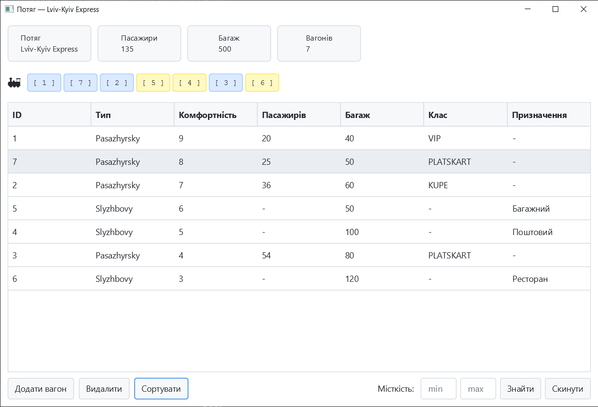
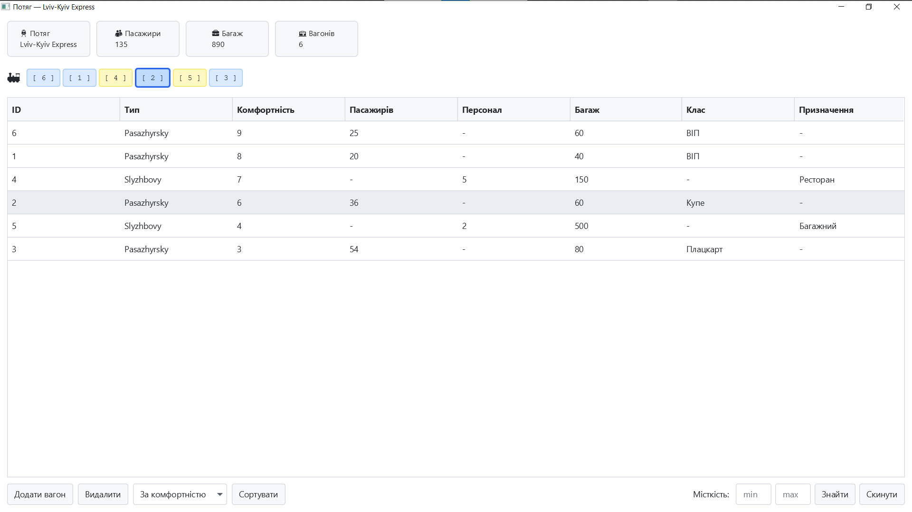
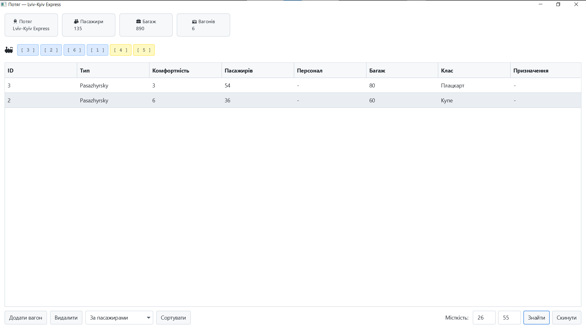
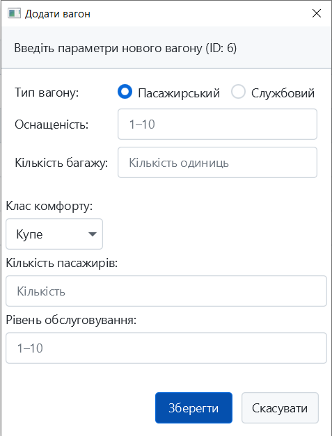

# 🚂 Railway Management System

**Курсова робота з дисципліни "Об'єктно-орієнтоване програмування"**


**Railway Management System** — сучасна настільна система для управління рухомим складом потягу. Проєкт демонструє застосування принципів ООП, N-Tier архітектури та патерну CQS для створення швидкого, масштабованого та зручного програмного продукту. Система підтримує динамічне додавання вагонів, розширений пошук за пасажиромісткістю, сортування та збереження стану в базу даних SQLite.

---

## 📸 Інтерфейс

| Головне вікно | Підсвітка пошуку та вагонів |
|:---:|:---:|
|  |  |

| Сортування списку | Додавання вагону |
|:---:|:---:|
|  |  |

---

## 🚀 Функціональні можливості

* **🔍 Гнучкий пошук:** Знаходження вагонів за діапазоном місткості пасажирів із динамічною підсвіткою у візуальній схемі.
* **💾 База даних SQLite:** Надійне збереження стану складу потяга (вагони, класи комфорту, багаж, персонал) локально через JDBC.
* **➕ Динамічне поповнення:** Можливість додавати нові пасажирські та службові вагони, які миттєво зберігаються в БД та відображаються у схемі потяга.
* **📜 Сортування:** Інтелектуальне сортування вагонів за рівнем комфортності та класом.
* **✨ Modern UI:** Адаптивний графічний інтерфейс на базі `JavaFX` із застосуванням преміальної теми `AtlantaFX` (PrimerLight) та динамічною колірною підсвіткою.
* **🛠 Архітектура:** Суворе дотримання N-Tier архітектури (Presentation -> Service -> Data Access) з використанням CQS та Command Pattern. Повна відсутність протікання логіки між шарами.

---

## 🛠️ Технічний стек

### Core & Backend
* **Мова:** Java 17
* **Архітектурні патерни:** N-Tier, Command/Query Separation, Command Pattern, Constructor Dependency Injection.
* **База даних:** SQLite (через JDBC) — файл `potiag.db`
* **Логування:** Logback + SLF4J
* **Тестування:** JUnit 5

### Frontend (UI)
* **Фреймворк:** JavaFX
* **Тема / Стилі:** AtlantaFX (PrimerLight theme)

---

## Архітектурна структура та технічний опис проєкту

Цей розділ містить опис структури каталогів, архітектурних рішень, взаємозв'язків між класами та призначення файлів в інформаційній системі управління пасажирським потягом.

### Огляд архітектури

Проєкт побудовано відповідно до багаторівневої архітектури (N-Tier) із впровадженням патерну CQS (Command Query Separation) та рівнем збереження даних (Persistence Layer) у базі даних SQLite:

* **Model (Моделі)**: класи пакету `model` (вагони, класи комфорту), що містять предметні дані та специфічні атрибути пасажирських і службових вагонів.
* **View (Представлення)**: головний клас графічного інтерфейсу `MainApp.java` в пакеті `ui`, стилізований за допомогою бібліотеки `AtlantaFX` (тема PrimerLight).
* **Command / Query (Патерн CQS)**: класи пакету `commands`, які інкапсулюють бізнес-операції (сортування, пошук, додавання, видалення) у вигляді незалежних об'єктів.
* **Service (Бізнес-логіка)**: клас `SkladService.java` в пакеті `services`, який виконує обчислювальні алгоритми та керує об'єктом `Potiag`.
* **Persistence Layer (База даних)**: клас `SqliteVagonRepository.java` в пакеті `repository`, який відповідає за підключення до SQLite та виконання CRUD-запитів через JDBC.

### Структура каталогів

```text
Java-Coursework-Railway/
├── .idea/                           # Конфігурація IntelliJ IDEA
├── logs/                            # Директорія для логів
│   └── app.log                      # Ротаційний файл журналу подій
├── src/                             # Вихідний код програми
│   ├── main/
│   │   ├── java/
│   │   │   ├── commands/            # Шар Команд та Запитів (CQS)
│   │   │   │   ├── Command.java             # Інтерфейс Command
│   │   │   │   ├── Query.java               # Інтерфейс Query
│   │   │   │   ├── AddVagonCommand.java     # Команда додавання
│   │   │   │   ├── DeleteVagonCommand.java  # Команда видалення
│   │   │   │   ├── SortVagonsCommand.java   # Команда сортування
│   │   │   │   └── FindVagonsQuery.java     # Запит на фільтрацію
│   │   │   ├── model/               # Предметна область (Домен)
│   │   │   │   ├── Vagon.java               # Абстрактний базовий клас вагона
│   │   │   │   ├── PasazhyrskyVagon.java    # Підклас пасажирського вагона
│   │   │   │   ├── SlyzhbovyVagon.java      # Підклас службового вагона
│   │   │   │   ├── Potiag.java              # Клас-контейнер складу потяга
│   │   │   │   └── KlasKomfortu.java        # Enum (ВІП, Купе, Плацкарт)
│   │   │   ├── repository/          # Шар доступу до даних
│   │   │   │   ├── VagonRepository.java     # Інтерфейс репозиторію
│   │   │   │   └── SqliteVagonRepository.java # Імплементація для SQLite
│   │   │   ├── services/            # Шар бізнес-логіки
│   │   │   │   ├── SkladService.java        # Сервіс управління складом
│   │   │   │   └── PotiagService.java       # Сервіс потяга
│   │   │   └── ui/                  # Презентаційний шар (GUI)
│   │   │       └── MainApp.java             # Головне вікно та контролер JavaFX
│   │   └── resources/               # Файли конфігурації
│   │       └── logback.xml          # Налаштування логера та SMTP
│   └── test/
│       └── java/                    # Модульні тести JUnit 5 + Mockito
│           ├── model/               # 161 юніт-тест (Coverage > 94%)
│           ├── commands/
│           ├── services/
│           └── repository/
├── screenshots/                     # Скріншоти для документації
├── potiag.db                        # Локальна база даних SQLite
└── pom.xml                          # 

```

### Опис пакетів та файлів

#### Точка входу та UI

* **`src/main/java/ui/MainApp.java`**: Клас-запускник програми та контролер. Ініціалізує тему `AtlantaFX`, підключається до БД, генерує головне вікно `BorderPane`. Містить логіку відображення таблиці `TableView`, динамічної візуальної схеми потяга (з жовтою/синьою підсвіткою), а також обробку Edge Cases (помилок вводу користувача).

#### Пакет `model/` (Бізнес-моделі)

Містить об'єктні моделі рухомого складу із використанням принципів успадкування та поліморфізму.

* **`Vagon.java`**: Абстрактний суперклас для всіх вагонів. Містить спільні поля: `id`, `vahaBagazhu` та `rivenKomfortnosti` (амортизація від 1 до 10). Оголошує абстрактний метод `getTyp()`.
* **`PasazhyrskyVagon.java`**: Підклас пасажирського вагона. Додає специфічні поля: `kilkistPasazhyriv` та `klas` (на основі Enum `KlasKomfortu`).
* **`SlyzhbovyVagon.java`**: Підклас службового вагона. Додає специфічні поля: `personal` (кількість працівників) та `pryznachennya` (текстове поле, наприклад "Ресторан").
* **`Potiag.java`**: Агрегатор, що містить список (List) вагонів та відповідає за розрахунок загальної статистики.

#### Пакет `repository/` (Збереження даних)

* **`SqliteVagonRepository.java`**: Реалізація доступу до даних. Ініціалізує БД через JDBC (`jdbc:sqlite:potiag.db`), автоматично створює таблицю `vagons` при першому запуску, виконує мапінг об'єктів Java у SQL-рядки. Містить метод `seedDataIfEmpty()` для автоматичного наповнення бази стартовими вагонами.

#### Пакет `services/` (Бізнес-логіка)

* **`SkladService.java`**: Сервісний шар. Виконує високорівневі операції з об'єктами. Використовує **Java Stream API** для сортування (через `Comparator`) та фільтрації колекції вагонів.

#### Пакет `commands/` (Архітектура CQS)

Реалізує патерн Command для ізоляції UI від сервісів.

* **`AddVagonCommand.java`**: Інкапсулює логіку валідації та додавання нового вагона в БД та модель.
* **`SortVagonsCommand.java`**: Виконує команду сортування за обраним критерієм.
* **`FindVagonsQuery.java`**: Виконує запит (фільтрацію) та повертає List релевантних вагонів.

#### Конфігурація

* **`logback.xml`**: Конфігурація логування. Визначає `ConsoleAppender` (інформація в консоль), `RollingFileAppender` (збереження історії у файл `app.log`) та `SMTPAppender` (автоматична відправка критичних `ERROR` повідомлень на email через SMTP).

## ⚙️ Інструкція із запуску

### Запуск додатку
Для запуску проекту використовується Maven та плагін JavaFX. Відкрийте термінал у кореневій папці проекту і виконайте команду:

```bash
mvn clean javafx:run
```

Система автоматично:
1. Скомпілює проект та завантажить залежності.
2. Створить файл `potiag.db` (якщо його не існує) та заповнить його стартовими даними для демонстрації.
3. Запустить графічний інтерфейс програми.

---

## 👤 Автор

**Студент групи ОІ-22 Петрунів Дмитро**  
Національний університет "Львівська політехніка"

## 📅 Release

**Версія:** v1.0  
**Рік:** 2026
